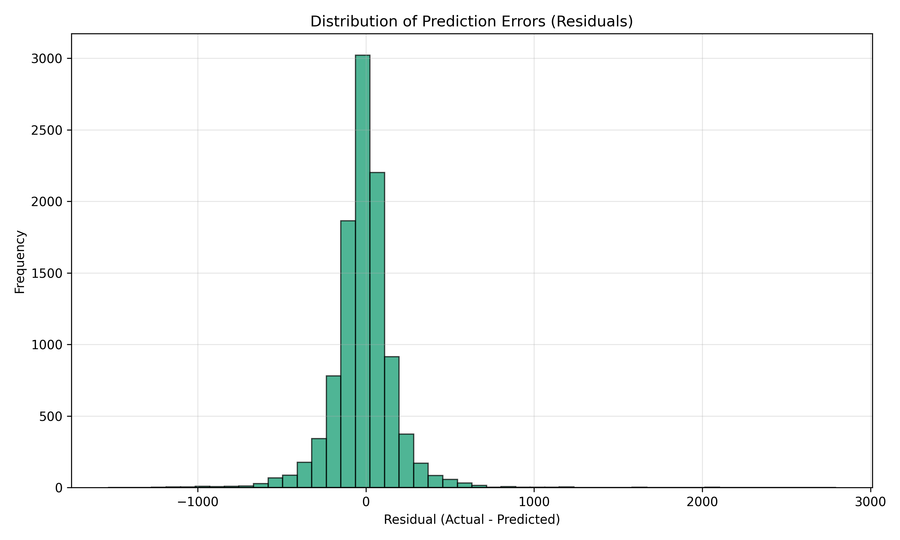

# Heat Transfer Coefficient Predictor

A machine learning project to predict the convective Heat Transfer Coefficient (HTC) of nanofluids in a circular tube.

**[🔴 LIVE DEMO: Click here to use the Predictor](https://hhemantpatel.github.io/HTC-predictor/)**

## Overview

This project uses a Multi-Layer Perceptron (MLP) regressor to predict HTC based on fluid properties and flow conditions. It is trained on experimental data from nanofluid studies.

## Features

- **Synthetic & Real Data Support**: Can generate synthetic data using correlations or load real experimental CSV datasets.
- **High Accuracy**: Achieves >0.99 R² score on test data.
- **Web Interface**: A modern Flask-based web UI for easy predictions.
- **Interactive Inference**: Command-line script for quick checks.


*Figure 1: The Heat Transfer Coefficient Predictor Web Interface.*

## Model Performance

The model shows excellent agreement with experimental data.


*Figure 2: Comparison of predicted vs actual Heat Transfer Coefficient values.*



*Figure 3: Distribution of prediction errors (residuals).*

## Installation

1. Clone the repository.
2. Install dependencies:
   ```bash
   pip install -r requirements.txt
   ```

## Usage

### Web Interface
Run the Flask app:
```bash
python src/app.py
```
Open [http://127.0.0.1:5000](http://127.0.0.1:5000) in your browser.

### Command Line
Run inference interactively:
```bash
python src/inference.py
```

### Training
To retrain the model:
```bash
python src/train.py
```

## Project Structure

- `src/`: Source code
  - `app.py`: Flask backend
  - `train.py`: Model training script
  - `inference.py`: Inference script
  - `data_generator.py`: Synthetic data generator
  - `templates/`: HTML frontend
- `data/`: Datasets
- `models/`: Saved model artifacts

## License

MIT
